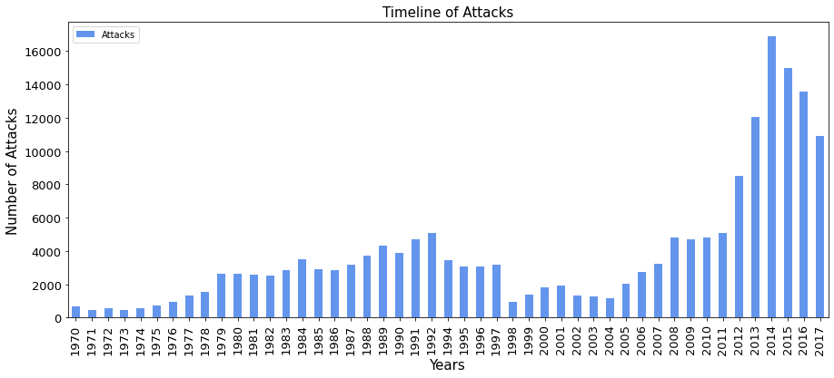
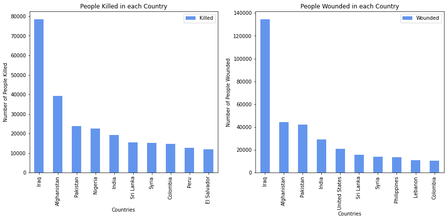

# Yash Gupta  - Exploratory Data Analysis On Terrorism

### DataScience and Business Analytics - Intern
Provided with 'Global Terrorism' dataset, performed exploratory data analysis

#### Importing the libraries


```python
import numpy as np
import pandas as pd
import matplotlib as mpl
import matplotlib.pyplot as plt
import seaborn as sns
%matplotlib inline
```

#### Observing the data
The data string is of latin1 encoding instead of UTF-8 encoding


```python
data=pd.read_csv("globalterrorismdb_0718dist.csv", encoding="latin1")
df=pd.DataFrame(data)
print("Data has been successfully imported")
df.head()
```

    c:\users\yash\appdata\local\programs\python\python38\lib\site-packages\IPython\core\interactiveshell.py:3251: DtypeWarning: Columns (4,6,31,33,61,62,63,76,79,90,92,94,96,114,115,121) have mixed types.Specify dtype option on import or set low_memory=False.
      exec(code_obj, self.user_global_ns, self.user_ns)
    

    Data has been successfully imported
    


<div>
<style scoped>
    .dataframe tbody tr th:only-of-type {
        vertical-align: middle;
    }

    .dataframe tbody tr th {
        vertical-align: top;
    }

    .dataframe thead th {
        text-align: right;
    }
</style>
<table border="1" class="dataframe">
  <thead>
    <tr style="text-align: right;">
      <th></th>
      <th>eventid</th>
      <th>iyear</th>
      <th>imonth</th>
      <th>iday</th>
      <th>approxdate</th>
      <th>extended</th>
      <th>resolution</th>
      <th>country</th>
      <th>country_txt</th>
      <th>region</th>
      <th>...</th>
      <th>addnotes</th>
      <th>scite1</th>
      <th>scite2</th>
      <th>scite3</th>
      <th>dbsource</th>
      <th>INT_LOG</th>
      <th>INT_IDEO</th>
      <th>INT_MISC</th>
      <th>INT_ANY</th>
      <th>related</th>
    </tr>
  </thead>
  <tbody>
    <tr>
      <th>0</th>
      <td>197000000001</td>
      <td>1970</td>
      <td>7</td>
      <td>2</td>
      <td>NaN</td>
      <td>0</td>
      <td>NaN</td>
      <td>58</td>
      <td>Dominican Republic</td>
      <td>2</td>
      <td>...</td>
      <td>NaN</td>
      <td>NaN</td>
      <td>NaN</td>
      <td>NaN</td>
      <td>PGIS</td>
      <td>0</td>
      <td>0</td>
      <td>0</td>
      <td>0</td>
      <td>NaN</td>
    </tr>
    <tr>
      <th>1</th>
      <td>197000000002</td>
      <td>1970</td>
      <td>0</td>
      <td>0</td>
      <td>NaN</td>
      <td>0</td>
      <td>NaN</td>
      <td>130</td>
      <td>Mexico</td>
      <td>1</td>
      <td>...</td>
      <td>NaN</td>
      <td>NaN</td>
      <td>NaN</td>
      <td>NaN</td>
      <td>PGIS</td>
      <td>0</td>
      <td>1</td>
      <td>1</td>
      <td>1</td>
      <td>NaN</td>
    </tr>
    <tr>
      <th>2</th>
      <td>197001000001</td>
      <td>1970</td>
      <td>1</td>
      <td>0</td>
      <td>NaN</td>
      <td>0</td>
      <td>NaN</td>
      <td>160</td>
      <td>Philippines</td>
      <td>5</td>
      <td>...</td>
      <td>NaN</td>
      <td>NaN</td>
      <td>NaN</td>
      <td>NaN</td>
      <td>PGIS</td>
      <td>-9</td>
      <td>-9</td>
      <td>1</td>
      <td>1</td>
      <td>NaN</td>
    </tr>
    <tr>
      <th>3</th>
      <td>197001000002</td>
      <td>1970</td>
      <td>1</td>
      <td>0</td>
      <td>NaN</td>
      <td>0</td>
      <td>NaN</td>
      <td>78</td>
      <td>Greece</td>
      <td>8</td>
      <td>...</td>
      <td>NaN</td>
      <td>NaN</td>
      <td>NaN</td>
      <td>NaN</td>
      <td>PGIS</td>
      <td>-9</td>
      <td>-9</td>
      <td>1</td>
      <td>1</td>
      <td>NaN</td>
    </tr>
    <tr>
      <th>4</th>
      <td>197001000003</td>
      <td>1970</td>
      <td>1</td>
      <td>0</td>
      <td>NaN</td>
      <td>0</td>
      <td>NaN</td>
      <td>101</td>
      <td>Japan</td>
      <td>4</td>
      <td>...</td>
      <td>NaN</td>
      <td>NaN</td>
      <td>NaN</td>
      <td>NaN</td>
      <td>PGIS</td>
      <td>-9</td>
      <td>-9</td>
      <td>1</td>
      <td>1</td>
      <td>NaN</td>
    </tr>
  </tbody>
</table>
<p>5 rows × 135 columns</p>
</div>


```python
df.info()
```

    <class 'pandas.core.frame.DataFrame'>
    RangeIndex: 181691 entries, 0 to 181690
    Columns: 135 entries, eventid to related
    dtypes: float64(55), int64(22), object(58)
    memory usage: 187.1+ MB
    


```python
df.shape
```


    (181691, 135)


```python
df.columns
```


    Index(['eventid', 'iyear', 'imonth', 'iday', 'approxdate', 'extended',
           'resolution', 'country', 'country_txt', 'region',
           ...
           'addnotes', 'scite1', 'scite2', 'scite3', 'dbsource', 'INT_LOG',
           'INT_IDEO', 'INT_MISC', 'INT_ANY', 'related'],
          dtype='object', length=135)


```python
for i in df.columns:
    print(i,end=", ")
```

    eventid, iyear, imonth, iday, approxdate, extended, resolution, country, country_txt, region, region_txt, provstate, city, latitude, longitude, specificity, vicinity, location, summary, crit1, crit2, crit3, doubtterr, alternative, alternative_txt, multiple, success, suicide, attacktype1, attacktype1_txt, attacktype2, attacktype2_txt, attacktype3, attacktype3_txt, targtype1, targtype1_txt, targsubtype1, targsubtype1_txt, corp1, target1, natlty1, natlty1_txt, targtype2, targtype2_txt, targsubtype2, targsubtype2_txt, corp2, target2, natlty2, natlty2_txt, targtype3, targtype3_txt, targsubtype3, targsubtype3_txt, corp3, target3, natlty3, natlty3_txt, gname, gsubname, gname2, gsubname2, gname3, gsubname3, motive, guncertain1, guncertain2, guncertain3, individual, nperps, nperpcap, claimed, claimmode, claimmode_txt, claim2, claimmode2, claimmode2_txt, claim3, claimmode3, claimmode3_txt, compclaim, weaptype1, weaptype1_txt, weapsubtype1, weapsubtype1_txt, weaptype2, weaptype2_txt, weapsubtype2, weapsubtype2_txt, weaptype3, weaptype3_txt, weapsubtype3, weapsubtype3_txt, weaptype4, weaptype4_txt, weapsubtype4, weapsubtype4_txt, weapdetail, nkill, nkillus, nkillter, nwound, nwoundus, nwoundte, property, propextent, propextent_txt, propvalue, propcomment, ishostkid, nhostkid, nhostkidus, nhours, ndays, divert, kidhijcountry, ransom, ransomamt, ransomamtus, ransompaid, ransompaidus, ransomnote, hostkidoutcome, hostkidoutcome_txt, nreleased, addnotes, scite1, scite2, scite3, dbsource, INT_LOG, INT_IDEO, INT_MISC, INT_ANY, related, 

#### Cleaning data


```python
df=df[["iyear","imonth","iday","country_txt","region_txt","provstate","city",
       "latitude","longitude","location","summary","attacktype1_txt","targtype1_txt",
       "gname","motive","weaptype1_txt","nkill","nwound","addnotes"]]
df.head()
```


<div>
<style scoped>
    .dataframe tbody tr th:only-of-type {
        vertical-align: middle;
    }

    .dataframe tbody tr th {
        vertical-align: top;
    }

    .dataframe thead th {
        text-align: right;
    }
</style>
<table border="1" class="dataframe">
  <thead>
    <tr style="text-align: right;">
      <th></th>
      <th>iyear</th>
      <th>imonth</th>
      <th>iday</th>
      <th>country_txt</th>
      <th>region_txt</th>
      <th>provstate</th>
      <th>city</th>
      <th>latitude</th>
      <th>longitude</th>
      <th>location</th>
      <th>summary</th>
      <th>attacktype1_txt</th>
      <th>targtype1_txt</th>
      <th>gname</th>
      <th>motive</th>
      <th>weaptype1_txt</th>
      <th>nkill</th>
      <th>nwound</th>
      <th>addnotes</th>
    </tr>
  </thead>
  <tbody>
    <tr>
      <th>0</th>
      <td>1970</td>
      <td>7</td>
      <td>2</td>
      <td>Dominican Republic</td>
      <td>Central America &amp; Caribbean</td>
      <td>NaN</td>
      <td>Santo Domingo</td>
      <td>18.456792</td>
      <td>-69.951164</td>
      <td>NaN</td>
      <td>NaN</td>
      <td>Assassination</td>
      <td>Private Citizens &amp; Property</td>
      <td>MANO-D</td>
      <td>NaN</td>
      <td>Unknown</td>
      <td>1.0</td>
      <td>0.0</td>
      <td>NaN</td>
    </tr>
    <tr>
      <th>1</th>
      <td>1970</td>
      <td>0</td>
      <td>0</td>
      <td>Mexico</td>
      <td>North America</td>
      <td>Federal</td>
      <td>Mexico city</td>
      <td>19.371887</td>
      <td>-99.086624</td>
      <td>NaN</td>
      <td>NaN</td>
      <td>Hostage Taking (Kidnapping)</td>
      <td>Government (Diplomatic)</td>
      <td>23rd of September Communist League</td>
      <td>NaN</td>
      <td>Unknown</td>
      <td>0.0</td>
      <td>0.0</td>
      <td>NaN</td>
    </tr>
    <tr>
      <th>2</th>
      <td>1970</td>
      <td>1</td>
      <td>0</td>
      <td>Philippines</td>
      <td>Southeast Asia</td>
      <td>Tarlac</td>
      <td>Unknown</td>
      <td>15.478598</td>
      <td>120.599741</td>
      <td>NaN</td>
      <td>NaN</td>
      <td>Assassination</td>
      <td>Journalists &amp; Media</td>
      <td>Unknown</td>
      <td>NaN</td>
      <td>Unknown</td>
      <td>1.0</td>
      <td>0.0</td>
      <td>NaN</td>
    </tr>
    <tr>
      <th>3</th>
      <td>1970</td>
      <td>1</td>
      <td>0</td>
      <td>Greece</td>
      <td>Western Europe</td>
      <td>Attica</td>
      <td>Athens</td>
      <td>37.997490</td>
      <td>23.762728</td>
      <td>NaN</td>
      <td>NaN</td>
      <td>Bombing/Explosion</td>
      <td>Government (Diplomatic)</td>
      <td>Unknown</td>
      <td>NaN</td>
      <td>Explosives</td>
      <td>NaN</td>
      <td>NaN</td>
      <td>NaN</td>
    </tr>
    <tr>
      <th>4</th>
      <td>1970</td>
      <td>1</td>
      <td>0</td>
      <td>Japan</td>
      <td>East Asia</td>
      <td>Fukouka</td>
      <td>Fukouka</td>
      <td>33.580412</td>
      <td>130.396361</td>
      <td>NaN</td>
      <td>NaN</td>
      <td>Facility/Infrastructure Attack</td>
      <td>Government (Diplomatic)</td>
      <td>Unknown</td>
      <td>NaN</td>
      <td>Incendiary</td>
      <td>NaN</td>
      <td>NaN</td>
      <td>NaN</td>
    </tr>
  </tbody>
</table>
</div>


```python
df.rename(columns={"iyear":"Year","imonth":"Month","iday":"Day","country_txt":"Country",
                   "region_txt":"Region","provstate":"Province/State","city":"City",
                   "latitude":"Latitude","longitude":"Longitude","location":"Location",
                   "summary":"Summary","attacktype1_txt":"Attack Type","targtype1_txt":"Target Type",
                   "gname":"Group Name","motive":"Motive","weaptype1_txt":"Weapon Type",
                   "nkill":"Killed","nwound":"Wounded","addnotes":"Add Notes"},inplace=True)
```


```python
df.head()
```


<div>
<style scoped>
    .dataframe tbody tr th:only-of-type {
        vertical-align: middle;
    }

    .dataframe tbody tr th {
        vertical-align: top;
    }

    .dataframe thead th {
        text-align: right;
    }
</style>
<table border="1" class="dataframe">
  <thead>
    <tr style="text-align: right;">
      <th></th>
      <th>Year</th>
      <th>Month</th>
      <th>Day</th>
      <th>Country</th>
      <th>Region</th>
      <th>Province/State</th>
      <th>City</th>
      <th>Latitude</th>
      <th>Longitude</th>
      <th>Location</th>
      <th>Summary</th>
      <th>Attack Type</th>
      <th>Target Type</th>
      <th>Group Name</th>
      <th>Motive</th>
      <th>Weapon Type</th>
      <th>Killed</th>
      <th>Wounded</th>
      <th>Add Notes</th>
    </tr>
  </thead>
  <tbody>
    <tr>
      <th>0</th>
      <td>1970</td>
      <td>7</td>
      <td>2</td>
      <td>Dominican Republic</td>
      <td>Central America &amp; Caribbean</td>
      <td>NaN</td>
      <td>Santo Domingo</td>
      <td>18.456792</td>
      <td>-69.951164</td>
      <td>NaN</td>
      <td>NaN</td>
      <td>Assassination</td>
      <td>Private Citizens &amp; Property</td>
      <td>MANO-D</td>
      <td>NaN</td>
      <td>Unknown</td>
      <td>1.0</td>
      <td>0.0</td>
      <td>NaN</td>
    </tr>
    <tr>
      <th>1</th>
      <td>1970</td>
      <td>0</td>
      <td>0</td>
      <td>Mexico</td>
      <td>North America</td>
      <td>Federal</td>
      <td>Mexico city</td>
      <td>19.371887</td>
      <td>-99.086624</td>
      <td>NaN</td>
      <td>NaN</td>
      <td>Hostage Taking (Kidnapping)</td>
      <td>Government (Diplomatic)</td>
      <td>23rd of September Communist League</td>
      <td>NaN</td>
      <td>Unknown</td>
      <td>0.0</td>
      <td>0.0</td>
      <td>NaN</td>
    </tr>
    <tr>
      <th>2</th>
      <td>1970</td>
      <td>1</td>
      <td>0</td>
      <td>Philippines</td>
      <td>Southeast Asia</td>
      <td>Tarlac</td>
      <td>Unknown</td>
      <td>15.478598</td>
      <td>120.599741</td>
      <td>NaN</td>
      <td>NaN</td>
      <td>Assassination</td>
      <td>Journalists &amp; Media</td>
      <td>Unknown</td>
      <td>NaN</td>
      <td>Unknown</td>
      <td>1.0</td>
      <td>0.0</td>
      <td>NaN</td>
    </tr>
    <tr>
      <th>3</th>
      <td>1970</td>
      <td>1</td>
      <td>0</td>
      <td>Greece</td>
      <td>Western Europe</td>
      <td>Attica</td>
      <td>Athens</td>
      <td>37.997490</td>
      <td>23.762728</td>
      <td>NaN</td>
      <td>NaN</td>
      <td>Bombing/Explosion</td>
      <td>Government (Diplomatic)</td>
      <td>Unknown</td>
      <td>NaN</td>
      <td>Explosives</td>
      <td>NaN</td>
      <td>NaN</td>
      <td>NaN</td>
    </tr>
    <tr>
      <th>4</th>
      <td>1970</td>
      <td>1</td>
      <td>0</td>
      <td>Japan</td>
      <td>East Asia</td>
      <td>Fukouka</td>
      <td>Fukouka</td>
      <td>33.580412</td>
      <td>130.396361</td>
      <td>NaN</td>
      <td>NaN</td>
      <td>Facility/Infrastructure Attack</td>
      <td>Government (Diplomatic)</td>
      <td>Unknown</td>
      <td>NaN</td>
      <td>Incendiary</td>
      <td>NaN</td>
      <td>NaN</td>
      <td>NaN</td>
    </tr>
  </tbody>
</table>
</div>


```python
df.info()
```

    <class 'pandas.core.frame.DataFrame'>
    RangeIndex: 181691 entries, 0 to 181690
    Data columns (total 19 columns):
     #   Column          Non-Null Count   Dtype  
    ---  ------          --------------   -----  
     0   Year            181691 non-null  int64  
     1   Month           181691 non-null  int64  
     2   Day             181691 non-null  int64  
     3   Country         181691 non-null  object 
     4   Region          181691 non-null  object 
     5   Province/State  181270 non-null  object 
     6   City            181257 non-null  object 
     7   Latitude        177135 non-null  float64
     8   Longitude       177134 non-null  float64
     9   Location        55495 non-null   object 
     10  Summary         115562 non-null  object 
     11  Attack Type     181691 non-null  object 
     12  Target Type     181691 non-null  object 
     13  Group Name      181691 non-null  object 
     14  Motive          50561 non-null   object 
     15  Weapon Type     181691 non-null  object 
     16  Killed          171378 non-null  float64
     17  Wounded         165380 non-null  float64
     18  Add Notes       28289 non-null   object 
    dtypes: float64(4), int64(3), object(12)
    memory usage: 26.3+ MB
    


```python
df.shape
```


    (181691, 19)


```python
df.isnull().sum()
```


    Year                   0
    Month                  0
    Day                    0
    Country                0
    Region                 0
    Province/State       421
    City                 434
    Latitude            4556
    Longitude           4557
    Location          126196
    Summary            66129
    Attack Type            0
    Target Type            0
    Group Name             0
    Motive            131130
    Weapon Type            0
    Killed             10313
    Wounded            16311
    Add Notes         153402
    dtype: int64


```python
df["Killed"]=df["Killed"].fillna(0)
df["Wounded"]=df["Wounded"].fillna(0)
df["Casualty"]=df["Killed"]+df["Wounded"]
```


```python
df.describe()
```


<div>
<style scoped>
    .dataframe tbody tr th:only-of-type {
        vertical-align: middle;
    }

    .dataframe tbody tr th {
        vertical-align: top;
    }

    .dataframe thead th {
        text-align: right;
    }
</style>
<table border="1" class="dataframe">
  <thead>
    <tr style="text-align: right;">
      <th></th>
      <th>Year</th>
      <th>Month</th>
      <th>Day</th>
      <th>Latitude</th>
      <th>Longitude</th>
      <th>Killed</th>
      <th>Wounded</th>
      <th>Casualty</th>
    </tr>
  </thead>
  <tbody>
    <tr>
      <th>count</th>
      <td>181691.000000</td>
      <td>181691.000000</td>
      <td>181691.000000</td>
      <td>177135.000000</td>
      <td>1.771340e+05</td>
      <td>181691.000000</td>
      <td>181691.000000</td>
      <td>181691.000000</td>
    </tr>
    <tr>
      <th>mean</th>
      <td>2002.638997</td>
      <td>6.467277</td>
      <td>15.505644</td>
      <td>23.498343</td>
      <td>-4.586957e+02</td>
      <td>2.266860</td>
      <td>2.883296</td>
      <td>5.150156</td>
    </tr>
    <tr>
      <th>std</th>
      <td>13.259430</td>
      <td>3.388303</td>
      <td>8.814045</td>
      <td>18.569242</td>
      <td>2.047790e+05</td>
      <td>11.227057</td>
      <td>34.309747</td>
      <td>40.555416</td>
    </tr>
    <tr>
      <th>min</th>
      <td>1970.000000</td>
      <td>0.000000</td>
      <td>0.000000</td>
      <td>-53.154613</td>
      <td>-8.618590e+07</td>
      <td>0.000000</td>
      <td>0.000000</td>
      <td>0.000000</td>
    </tr>
    <tr>
      <th>25%</th>
      <td>1991.000000</td>
      <td>4.000000</td>
      <td>8.000000</td>
      <td>11.510046</td>
      <td>4.545640e+00</td>
      <td>0.000000</td>
      <td>0.000000</td>
      <td>0.000000</td>
    </tr>
    <tr>
      <th>50%</th>
      <td>2009.000000</td>
      <td>6.000000</td>
      <td>15.000000</td>
      <td>31.467463</td>
      <td>4.324651e+01</td>
      <td>0.000000</td>
      <td>0.000000</td>
      <td>1.000000</td>
    </tr>
    <tr>
      <th>75%</th>
      <td>2014.000000</td>
      <td>9.000000</td>
      <td>23.000000</td>
      <td>34.685087</td>
      <td>6.871033e+01</td>
      <td>2.000000</td>
      <td>2.000000</td>
      <td>4.000000</td>
    </tr>
    <tr>
      <th>max</th>
      <td>2017.000000</td>
      <td>12.000000</td>
      <td>31.000000</td>
      <td>74.633553</td>
      <td>1.793667e+02</td>
      <td>1570.000000</td>
      <td>8191.000000</td>
      <td>9574.000000</td>
    </tr>
  </tbody>
</table>
</div>


#### Observation
1. The data consists of terrorist activities ranging from the year: 1970 to 2017
2. Maximum number of people killed in an event were: 1570
3. Maximum number of people wounded in an event were: 8191
4. Maximum number of total casualties in an event were: 9574

#### Visualizing the data

#### 1. Year wise Attacks
Number of Attacks in each Year


```python
attacks=df["Year"].value_counts(dropna=False).sort_index().to_frame().reset_index().rename(columns={"index":"Year","Year":"Attacks"}).set_index("Year")
attacks.head()
```


<div>
<style scoped>
    .dataframe tbody tr th:only-of-type {
        vertical-align: middle;
    }

    .dataframe tbody tr th {
        vertical-align: top;
    }

    .dataframe thead th {
        text-align: right;
    }
</style>
<table border="1" class="dataframe">
  <thead>
    <tr style="text-align: right;">
      <th></th>
      <th>Attacks</th>
    </tr>
    <tr>
      <th>Year</th>
      <th></th>
    </tr>
  </thead>
  <tbody>
    <tr>
      <th>1970</th>
      <td>651</td>
    </tr>
    <tr>
      <th>1971</th>
      <td>471</td>
    </tr>
    <tr>
      <th>1972</th>
      <td>568</td>
    </tr>
    <tr>
      <th>1973</th>
      <td>473</td>
    </tr>
    <tr>
      <th>1974</th>
      <td>581</td>
    </tr>
  </tbody>
</table>
</div>


```python
attacks.plot(kind="bar",color="cornflowerblue",figsize=(15,6),fontsize=13)
plt.title("Timeline of Attacks",fontsize=15)
plt.xlabel("Years",fontsize=15)
plt.ylabel("Number of Attacks",fontsize=15)
plt.show()
```


    

    


(i). Most number of attacks(16903) in 2014  


(ii). Least number of attacks(471) in 1971 

1. Total Casualties (Killed + Wounded) in each Year


```python
yc=df[["Year","Casualty"]].groupby("Year").sum()
yc.head()
```


<div>
<style scoped>
    .dataframe tbody tr th:only-of-type {
        vertical-align: middle;
    }

    .dataframe tbody tr th {
        vertical-align: top;
    }

    .dataframe thead th {
        text-align: right;
    }
</style>
<table border="1" class="dataframe">
  <thead>
    <tr style="text-align: right;">
      <th></th>
      <th>Casualty</th>
    </tr>
    <tr>
      <th>Year</th>
      <th></th>
    </tr>
  </thead>
  <tbody>
    <tr>
      <th>1970</th>
      <td>386.0</td>
    </tr>
    <tr>
      <th>1971</th>
      <td>255.0</td>
    </tr>
    <tr>
      <th>1972</th>
      <td>975.0</td>
    </tr>
    <tr>
      <th>1973</th>
      <td>865.0</td>
    </tr>
    <tr>
      <th>1974</th>
      <td>1404.0</td>
    </tr>
  </tbody>
</table>
</div>


```python
yc.plot(kind="bar",color="cornflowerblue",figsize=(15,6))
plt.title("Year wise Casualties",fontsize=13)
plt.xlabel("Years",fontsize=13)
plt.xticks(fontsize=12)
plt.ylabel("Number of Casualties",fontsize=13)
plt.show()
```


    

    


1. Killed in each Year


```python
yk=df[["Year","Killed"]].groupby("Year").sum()
yk.head()
```


<div>
<style scoped>
    .dataframe tbody tr th:only-of-type {
        vertical-align: middle;
    }

    .dataframe tbody tr th {
        vertical-align: top;
    }

    .dataframe thead th {
        text-align: right;
    }
</style>
<table border="1" class="dataframe">
  <thead>
    <tr style="text-align: right;">
      <th></th>
      <th>Killed</th>
    </tr>
    <tr>
      <th>Year</th>
      <th></th>
    </tr>
  </thead>
  <tbody>
    <tr>
      <th>1970</th>
      <td>174.0</td>
    </tr>
    <tr>
      <th>1971</th>
      <td>173.0</td>
    </tr>
    <tr>
      <th>1972</th>
      <td>566.0</td>
    </tr>
    <tr>
      <th>1973</th>
      <td>370.0</td>
    </tr>
    <tr>
      <th>1974</th>
      <td>539.0</td>
    </tr>
  </tbody>
</table>
</div>


1. Wounded in each Region


```python
yw=df[["Year","Wounded"]].groupby("Year").sum()
yw.head()
```


<div>
<style scoped>
    .dataframe tbody tr th:only-of-type {
        vertical-align: middle;
    }

    .dataframe tbody tr th {
        vertical-align: top;
    }

    .dataframe thead th {
        text-align: right;
    }
</style>
<table border="1" class="dataframe">
  <thead>
    <tr style="text-align: right;">
      <th></th>
      <th>Wounded</th>
    </tr>
    <tr>
      <th>Year</th>
      <th></th>
    </tr>
  </thead>
  <tbody>
    <tr>
      <th>1970</th>
      <td>212.0</td>
    </tr>
    <tr>
      <th>1971</th>
      <td>82.0</td>
    </tr>
    <tr>
      <th>1972</th>
      <td>409.0</td>
    </tr>
    <tr>
      <th>1973</th>
      <td>495.0</td>
    </tr>
    <tr>
      <th>1974</th>
      <td>865.0</td>
    </tr>
  </tbody>
</table>
</div>


```python
fig=plt.figure()
ax0=fig.add_subplot(2,1,1)
ax1=fig.add_subplot(2,1,2)

#Killed
yk.plot(kind="bar",color="cornflowerblue",figsize=(15,15),ax=ax0)
ax0.set_title("People Killed in each Year")
ax0.set_xlabel("Years")
ax0.set_ylabel("Number of People Killed") 

#Wounded
yw.plot(kind="bar",color="cornflowerblue",figsize=(15,15),ax=ax1)
ax1.set_title("People Wounded in each Year")
ax1.set_xlabel("Years")
ax1.set_ylabel("Number of People Wounded")

plt.show()
```


    

    


#### 2. Region wise Attacks

1. Distribution of Terrorist Attacks over Regions from 1970-2017


```python
reg=pd.crosstab(df.Year,df.Region)
reg.head()
```


<div>
<style scoped>
    .dataframe tbody tr th:only-of-type {
        vertical-align: middle;
    }

    .dataframe tbody tr th {
        vertical-align: top;
    }

    .dataframe thead th {
        text-align: right;
    }
</style>
<table border="1" class="dataframe">
  <thead>
    <tr style="text-align: right;">
      <th>Region</th>
      <th>Australasia &amp; Oceania</th>
      <th>Central America &amp; Caribbean</th>
      <th>Central Asia</th>
      <th>East Asia</th>
      <th>Eastern Europe</th>
      <th>Middle East &amp; North Africa</th>
      <th>North America</th>
      <th>South America</th>
      <th>South Asia</th>
      <th>Southeast Asia</th>
      <th>Sub-Saharan Africa</th>
      <th>Western Europe</th>
    </tr>
    <tr>
      <th>Year</th>
      <th></th>
      <th></th>
      <th></th>
      <th></th>
      <th></th>
      <th></th>
      <th></th>
      <th></th>
      <th></th>
      <th></th>
      <th></th>
      <th></th>
    </tr>
  </thead>
  <tbody>
    <tr>
      <th>1970</th>
      <td>1</td>
      <td>7</td>
      <td>0</td>
      <td>2</td>
      <td>12</td>
      <td>28</td>
      <td>472</td>
      <td>65</td>
      <td>1</td>
      <td>10</td>
      <td>3</td>
      <td>50</td>
    </tr>
    <tr>
      <th>1971</th>
      <td>1</td>
      <td>5</td>
      <td>0</td>
      <td>1</td>
      <td>5</td>
      <td>55</td>
      <td>247</td>
      <td>24</td>
      <td>0</td>
      <td>6</td>
      <td>2</td>
      <td>125</td>
    </tr>
    <tr>
      <th>1972</th>
      <td>8</td>
      <td>3</td>
      <td>0</td>
      <td>0</td>
      <td>1</td>
      <td>53</td>
      <td>73</td>
      <td>33</td>
      <td>1</td>
      <td>16</td>
      <td>4</td>
      <td>376</td>
    </tr>
    <tr>
      <th>1973</th>
      <td>1</td>
      <td>6</td>
      <td>0</td>
      <td>2</td>
      <td>1</td>
      <td>19</td>
      <td>64</td>
      <td>83</td>
      <td>1</td>
      <td>2</td>
      <td>4</td>
      <td>290</td>
    </tr>
    <tr>
      <th>1974</th>
      <td>1</td>
      <td>11</td>
      <td>0</td>
      <td>4</td>
      <td>2</td>
      <td>42</td>
      <td>111</td>
      <td>81</td>
      <td>2</td>
      <td>3</td>
      <td>7</td>
      <td>317</td>
    </tr>
  </tbody>
</table>
</div>


```python
reg.plot(kind="area", stacked=False, alpha=0.5,figsize=(20,10))
plt.title("Region wise attacks",fontsize=20)
plt.xlabel("Years",fontsize=20)
plt.ylabel("Number of Attacks",fontsize=20)
plt.show()
```


    

    


1. Total Terrorist Attacks in each Region from 1970-2017


```python
regt=reg.transpose()
regt["Total"]=regt.sum(axis=1)
ra=regt["Total"].sort_values(ascending=False)
ra
```


    Region
    Middle East & North Africa     50474
    South Asia                     44974
    South America                  18978
    Sub-Saharan Africa             17550
    Western Europe                 16639
    Southeast Asia                 12485
    Central America & Caribbean    10344
    Eastern Europe                  5144
    North America                   3456
    East Asia                        802
    Central Asia                     563
    Australasia & Oceania            282
    Name: Total, dtype: int64


```python
ra.plot(kind="bar",figsize=(15,6))
plt.title("Total Number of Attacks in each Region from 1970-2017")
plt.xlabel("Region")
plt.ylabel("Number of Attacks")
plt.show()
```


    

    


1. Total Casualties (Killed + Wounded) in each Region


```python
rc=df[["Region","Casualty"]].groupby("Region").sum().sort_values(by="Casualty",ascending=False)
rc
```


<div>
<style scoped>
    .dataframe tbody tr th:only-of-type {
        vertical-align: middle;
    }

    .dataframe tbody tr th {
        vertical-align: top;
    }

    .dataframe thead th {
        text-align: right;
    }
</style>
<table border="1" class="dataframe">
  <thead>
    <tr style="text-align: right;">
      <th></th>
      <th>Casualty</th>
    </tr>
    <tr>
      <th>Region</th>
      <th></th>
    </tr>
  </thead>
  <tbody>
    <tr>
      <th>Middle East &amp; North Africa</th>
      <td>351950.0</td>
    </tr>
    <tr>
      <th>South Asia</th>
      <td>242679.0</td>
    </tr>
    <tr>
      <th>Sub-Saharan Africa</th>
      <td>131243.0</td>
    </tr>
    <tr>
      <th>South America</th>
      <td>45553.0</td>
    </tr>
    <tr>
      <th>Southeast Asia</th>
      <td>41896.0</td>
    </tr>
    <tr>
      <th>Central America &amp; Caribbean</th>
      <td>37699.0</td>
    </tr>
    <tr>
      <th>North America</th>
      <td>26447.0</td>
    </tr>
    <tr>
      <th>Western Europe</th>
      <td>25026.0</td>
    </tr>
    <tr>
      <th>Eastern Europe</th>
      <td>19460.0</td>
    </tr>
    <tr>
      <th>East Asia</th>
      <td>10365.0</td>
    </tr>
    <tr>
      <th>Central Asia</th>
      <td>3009.0</td>
    </tr>
    <tr>
      <th>Australasia &amp; Oceania</th>
      <td>410.0</td>
    </tr>
  </tbody>
</table>
</div>


```python
rc.plot(kind="bar",color="cornflowerblue",figsize=(15,6))
plt.title("Region wise Casualties",fontsize=13)
plt.xlabel("Regions",fontsize=13)
plt.xticks(fontsize=12)
plt.ylabel("Number of Casualties",fontsize=13)
plt.show()
```


    

    


1. Killed in each Region


```python
rk=df[["Region","Killed"]].groupby("Region").sum().sort_values(by="Killed",ascending=False)
rk
```


<div>
<style scoped>
    .dataframe tbody tr th:only-of-type {
        vertical-align: middle;
    }

    .dataframe tbody tr th {
        vertical-align: top;
    }

    .dataframe thead th {
        text-align: right;
    }
</style>
<table border="1" class="dataframe">
  <thead>
    <tr style="text-align: right;">
      <th></th>
      <th>Killed</th>
    </tr>
    <tr>
      <th>Region</th>
      <th></th>
    </tr>
  </thead>
  <tbody>
    <tr>
      <th>Middle East &amp; North Africa</th>
      <td>137642.0</td>
    </tr>
    <tr>
      <th>South Asia</th>
      <td>101319.0</td>
    </tr>
    <tr>
      <th>Sub-Saharan Africa</th>
      <td>78386.0</td>
    </tr>
    <tr>
      <th>South America</th>
      <td>28849.0</td>
    </tr>
    <tr>
      <th>Central America &amp; Caribbean</th>
      <td>28708.0</td>
    </tr>
    <tr>
      <th>Southeast Asia</th>
      <td>15637.0</td>
    </tr>
    <tr>
      <th>Eastern Europe</th>
      <td>7415.0</td>
    </tr>
    <tr>
      <th>Western Europe</th>
      <td>6694.0</td>
    </tr>
    <tr>
      <th>North America</th>
      <td>4916.0</td>
    </tr>
    <tr>
      <th>East Asia</th>
      <td>1152.0</td>
    </tr>
    <tr>
      <th>Central Asia</th>
      <td>1000.0</td>
    </tr>
    <tr>
      <th>Australasia &amp; Oceania</th>
      <td>150.0</td>
    </tr>
  </tbody>
</table>
</div>


1. Wounded in each Region


```python
rw=df[["Region","Wounded"]].groupby("Region").sum().sort_values(by="Wounded",ascending=False)
rw
```


<div>
<style scoped>
    .dataframe tbody tr th:only-of-type {
        vertical-align: middle;
    }

    .dataframe tbody tr th {
        vertical-align: top;
    }

    .dataframe thead th {
        text-align: right;
    }
</style>
<table border="1" class="dataframe">
  <thead>
    <tr style="text-align: right;">
      <th></th>
      <th>Wounded</th>
    </tr>
    <tr>
      <th>Region</th>
      <th></th>
    </tr>
  </thead>
  <tbody>
    <tr>
      <th>Middle East &amp; North Africa</th>
      <td>214308.0</td>
    </tr>
    <tr>
      <th>South Asia</th>
      <td>141360.0</td>
    </tr>
    <tr>
      <th>Sub-Saharan Africa</th>
      <td>52857.0</td>
    </tr>
    <tr>
      <th>Southeast Asia</th>
      <td>26259.0</td>
    </tr>
    <tr>
      <th>North America</th>
      <td>21531.0</td>
    </tr>
    <tr>
      <th>Western Europe</th>
      <td>18332.0</td>
    </tr>
    <tr>
      <th>South America</th>
      <td>16704.0</td>
    </tr>
    <tr>
      <th>Eastern Europe</th>
      <td>12045.0</td>
    </tr>
    <tr>
      <th>East Asia</th>
      <td>9213.0</td>
    </tr>
    <tr>
      <th>Central America &amp; Caribbean</th>
      <td>8991.0</td>
    </tr>
    <tr>
      <th>Central Asia</th>
      <td>2009.0</td>
    </tr>
    <tr>
      <th>Australasia &amp; Oceania</th>
      <td>260.0</td>
    </tr>
  </tbody>
</table>
</div>


```python
fig=plt.figure()
ax0=fig.add_subplot(1,2,1)
ax1=fig.add_subplot(1,2,2)

#Killed
rk.plot(kind="bar",color="cornflowerblue",figsize=(15,6),ax=ax0)
ax0.set_title("People Killed in each Region")
ax0.set_xlabel("Regions")
ax0.set_ylabel("Number of People Killed")

#Wounded
rw.plot(kind="bar",color="cornflowerblue",figsize=(15,6),ax=ax1)
ax1.set_title("People Wounded in each Region")
ax1.set_xlabel("Regions")
ax1.set_ylabel("Number of People Wounded")

plt.show()
```


    

    


#### 3. Country wise Attacks - Top 10

1. Number of Attacks in each Country


```python
ct=df["Country"].value_counts().head(10)
ct
```


    Iraq              24636
    Pakistan          14368
    Afghanistan       12731
    India             11960
    Colombia           8306
    Philippines        6908
    Peru               6096
    El Salvador        5320
    United Kingdom     5235
    Turkey             4292
    Name: Country, dtype: int64


```python
ct.plot(kind="bar",color="cornflowerblue",figsize=(15,6))
plt.title("Country wise Attacks",fontsize=13)
plt.xlabel("Countries",fontsize=13)
plt.xticks(fontsize=12)
plt.ylabel("Number of Attacks",fontsize=13)
plt.show()
```


    

    


1. Total Casualties (Killed + Wounded) in each Country


```python
cnc=df[["Country","Casualty"]].groupby("Country").sum().sort_values(by="Casualty",ascending=False)
cnc.head(10)
```


<div>
<style scoped>
    .dataframe tbody tr th:only-of-type {
        vertical-align: middle;
    }

    .dataframe tbody tr th {
        vertical-align: top;
    }

    .dataframe thead th {
        text-align: right;
    }
</style>
<table border="1" class="dataframe">
  <thead>
    <tr style="text-align: right;">
      <th></th>
      <th>Casualty</th>
    </tr>
    <tr>
      <th>Country</th>
      <th></th>
    </tr>
  </thead>
  <tbody>
    <tr>
      <th>Iraq</th>
      <td>213279.0</td>
    </tr>
    <tr>
      <th>Afghanistan</th>
      <td>83661.0</td>
    </tr>
    <tr>
      <th>Pakistan</th>
      <td>65860.0</td>
    </tr>
    <tr>
      <th>India</th>
      <td>48321.0</td>
    </tr>
    <tr>
      <th>Nigeria</th>
      <td>32921.0</td>
    </tr>
    <tr>
      <th>Sri Lanka</th>
      <td>31091.0</td>
    </tr>
    <tr>
      <th>Syria</th>
      <td>29338.0</td>
    </tr>
    <tr>
      <th>Colombia</th>
      <td>25026.0</td>
    </tr>
    <tr>
      <th>United States</th>
      <td>24473.0</td>
    </tr>
    <tr>
      <th>Philippines</th>
      <td>22926.0</td>
    </tr>
  </tbody>
</table>
</div>


```python
cnc[:10].plot(kind="bar",color="cornflowerblue",figsize=(15,6))
plt.title("Country wie Casualties",fontsize=13)
plt.xlabel("Countries",fontsize=13)
plt.xticks(fontsize=12)
plt.ylabel("Number of Casualties",fontsize=13)
plt.show()
```


    

    


1. Killed in each Country


```python
cnk=df[["Country","Killed"]].groupby("Country").sum().sort_values(by="Killed",ascending=False)
cnk.head(10)
```


<div>
<style scoped>
    .dataframe tbody tr th:only-of-type {
        vertical-align: middle;
    }

    .dataframe tbody tr th {
        vertical-align: top;
    }

    .dataframe thead th {
        text-align: right;
    }
</style>
<table border="1" class="dataframe">
  <thead>
    <tr style="text-align: right;">
      <th></th>
      <th>Killed</th>
    </tr>
    <tr>
      <th>Country</th>
      <th></th>
    </tr>
  </thead>
  <tbody>
    <tr>
      <th>Iraq</th>
      <td>78589.0</td>
    </tr>
    <tr>
      <th>Afghanistan</th>
      <td>39384.0</td>
    </tr>
    <tr>
      <th>Pakistan</th>
      <td>23822.0</td>
    </tr>
    <tr>
      <th>Nigeria</th>
      <td>22682.0</td>
    </tr>
    <tr>
      <th>India</th>
      <td>19341.0</td>
    </tr>
    <tr>
      <th>Sri Lanka</th>
      <td>15530.0</td>
    </tr>
    <tr>
      <th>Syria</th>
      <td>15229.0</td>
    </tr>
    <tr>
      <th>Colombia</th>
      <td>14698.0</td>
    </tr>
    <tr>
      <th>Peru</th>
      <td>12771.0</td>
    </tr>
    <tr>
      <th>El Salvador</th>
      <td>12053.0</td>
    </tr>
  </tbody>
</table>
</div>


1.Wounded in each Country


```python
cnw=df[["Country","Wounded"]].groupby("Country").sum().sort_values(by="Wounded",ascending=False)
cnw.head(10)
```


<div>
<style scoped>
    .dataframe tbody tr th:only-of-type {
        vertical-align: middle;
    }

    .dataframe tbody tr th {
        vertical-align: top;
    }

    .dataframe thead th {
        text-align: right;
    }
</style>
<table border="1" class="dataframe">
  <thead>
    <tr style="text-align: right;">
      <th></th>
      <th>Wounded</th>
    </tr>
    <tr>
      <th>Country</th>
      <th></th>
    </tr>
  </thead>
  <tbody>
    <tr>
      <th>Iraq</th>
      <td>134690.0</td>
    </tr>
    <tr>
      <th>Afghanistan</th>
      <td>44277.0</td>
    </tr>
    <tr>
      <th>Pakistan</th>
      <td>42038.0</td>
    </tr>
    <tr>
      <th>India</th>
      <td>28980.0</td>
    </tr>
    <tr>
      <th>United States</th>
      <td>20702.0</td>
    </tr>
    <tr>
      <th>Sri Lanka</th>
      <td>15561.0</td>
    </tr>
    <tr>
      <th>Syria</th>
      <td>14109.0</td>
    </tr>
    <tr>
      <th>Philippines</th>
      <td>13367.0</td>
    </tr>
    <tr>
      <th>Lebanon</th>
      <td>10904.0</td>
    </tr>
    <tr>
      <th>Colombia</th>
      <td>10328.0</td>
    </tr>
  </tbody>
</table>
</div>


```python
fig=plt.figure()
ax0=fig.add_subplot(1,2,1)
ax1=fig.add_subplot(1,2,2)

#Killed
cnk[:10].plot(kind="bar",color="cornflowerblue",figsize=(15,6),ax=ax0)
ax0.set_title("People Killed in each Country")
ax0.set_xlabel("Countries")
ax0.set_ylabel("Number of People Killed")

#Wounded
cnw[:10].plot(kind="bar",color="cornflowerblue",figsize=(15,6),ax=ax1)
ax1.set_title("People Wounded in each Country")
ax1.set_xlabel("Countries")
ax1.set_ylabel("Number of People Wounded")

plt.show()
```


    

    


```python

```
